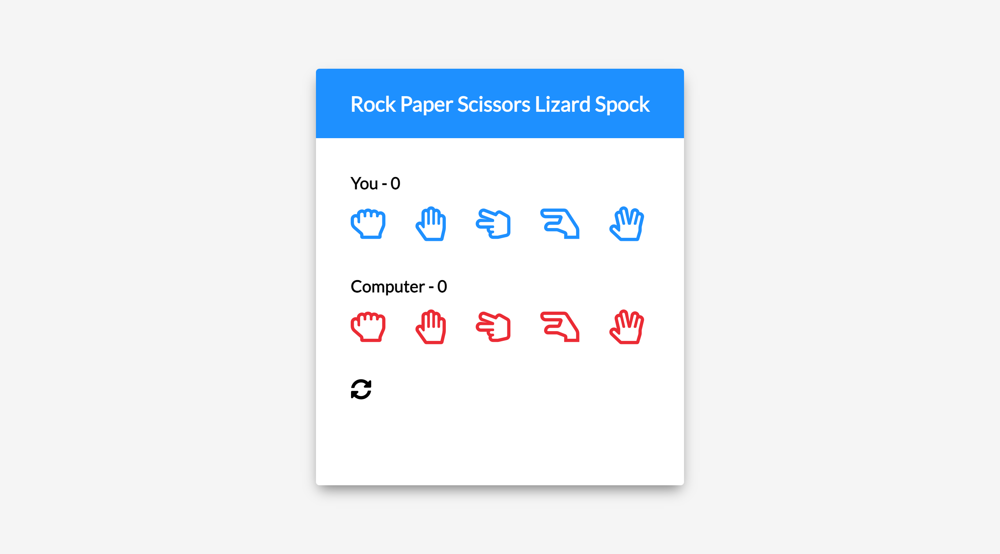

This Spock Rock Game built with HTML, CSS, JavaScript. Game concept is inspired by Big Bang Theory.

Rules :[Click here](https://www.youtube.com/watch?v=405Nh2H4Ucg)

## Table of contents

- [Table of contents](#table-of-contents)
- [Overview](#overview)
  - [Screenshot](#screenshot)
  - [Links](#links)
  - [Built with](#built-with)
- [Author](#author)

## Overview

Users should be able to:

- Users can play the game with computer.
- If the users win, confettis will show.

### Screenshot

### Links

- Live Site: [Click here](https://simpleluke.github.io/Spock-Rock-Game/)

### Built with

- HTML
- CSS
- JavaScript

## Author

- Website - [Luke Lai](https://lukelai.tech/)
- LinkedIn - [Luke Lai](https://www.linkedin.com/in/luke-lai-309a3522b/)
- Twitter - [@LukeLaiDev](https://www.twitter.com/LukeLaiDev)
